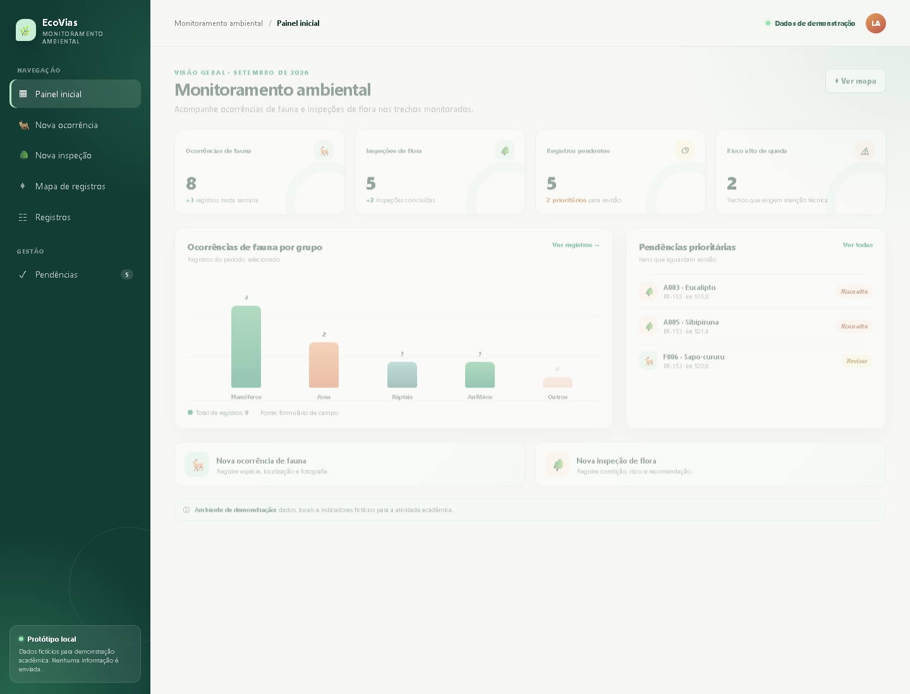
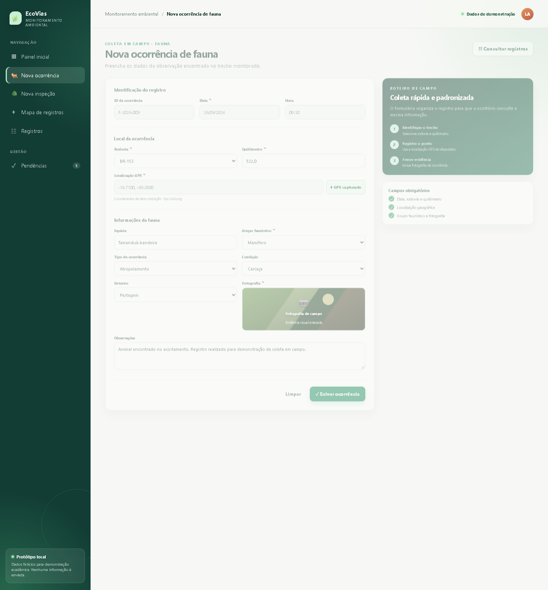
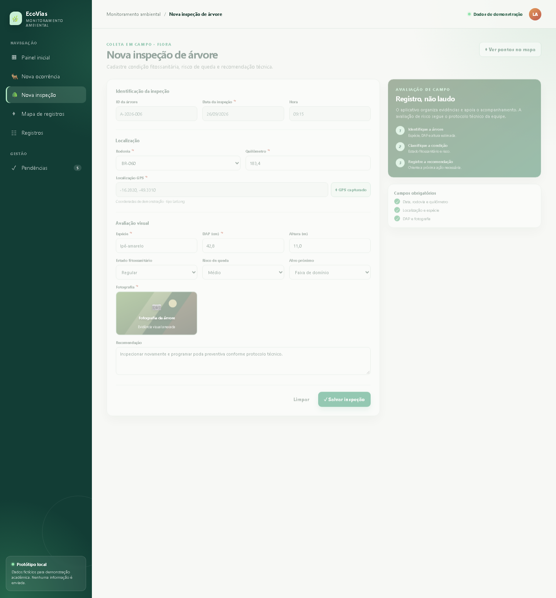
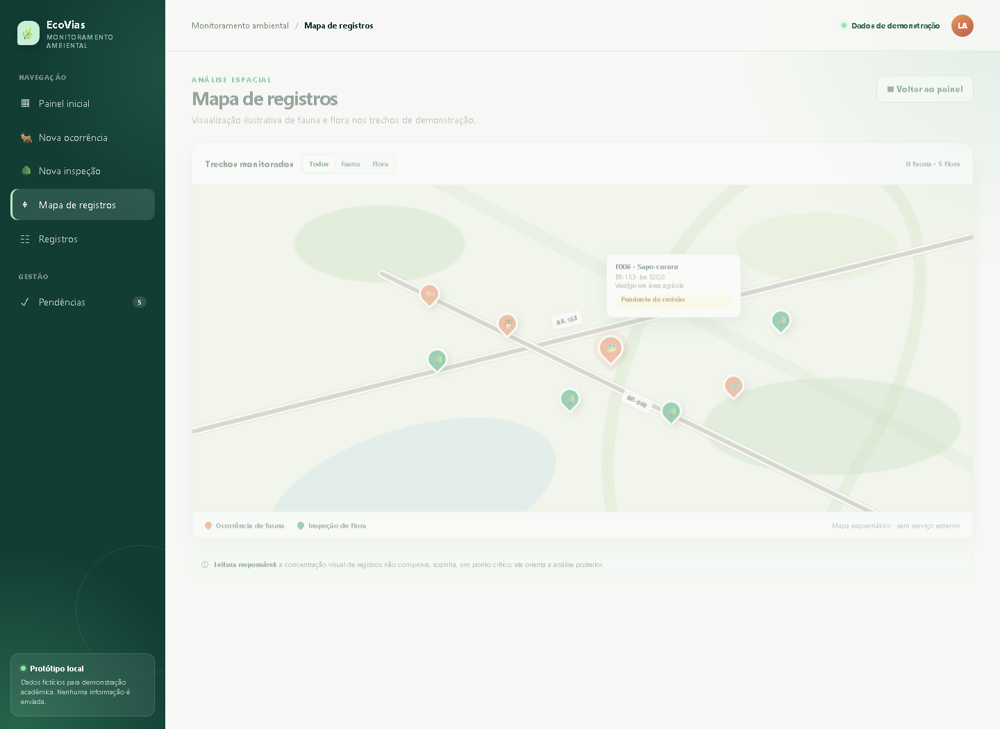

# EcoVias — Monitoramento de Fauna e Flora

Protótipo acadêmico de um aplicativo para registrar e acompanhar ocorrências de fauna e inspeções de flora em rodovias.

O projeto simula o fluxo de trabalho de uma solução construída no AppSheet: coleta em campo, registro de localização, evidência fotográfica, consulta dos dados, mapa e painel de indicadores. Todos os dados são fictícios e nenhuma informação é enviada para serviços externos.

## Funcionalidades

- Painel com indicadores ambientais;
- Registro de ocorrências de fauna;
- Registro de inspeções de flora;
- Campos simulados de localização GPS e fotografia;
- Mapa esquemático com ocorrências georreferenciadas;
- Listagem consolidada dos registros;
- Fila de pendências para revisão;
- Planilha-base compatível com a estrutura proposta para o AppSheet.

## Tecnologias

- HTML5 para a estrutura das telas;
- CSS3 para o layout responsivo e a identidade visual;
- JavaScript para navegação e interações;
- PowerShell para gerar a planilha-base;
- Microsoft Excel/Google Sheets como modelo de dados.

O protótipo não utiliza API, framework, banco de dados ou dependências externas.

## Como executar

### Abertura direta

No PowerShell:

~~~powershell
cd "C:\Users\lucas\OneDrive\Área de Trabalho\ATVD FAUNA"
Start-Process .\index.html
~~~

### Servidor local

Com Python instalado:

~~~powershell
cd "C:\Users\lucas\OneDrive\Área de Trabalho\ATVD FAUNA"
py -m http.server 8000
~~~

Depois, acesse:

~~~text
http://localhost:8000
~~~

Para encerrar o servidor, pressione **Ctrl + C**.

## Telas

| Tela | Endereço local | Objetivo |
|---|---|---|
| Painel inicial | index.html#inicio | Visualizar indicadores e atalhos |
| Nova ocorrência | index.html#fauna | Registrar uma ocorrência de fauna |
| Nova inspeção | index.html#flora | Registrar uma inspeção de flora |
| Mapa | index.html#mapa | Visualizar os pontos monitorados |
| Registros | index.html#registros | Consultar os dados de campo |
| Pendências | index.html#pendencias | Acompanhar itens para revisão |

## Modelo de dados

### Fauna

ID_Ocorrencia, Data, Hora, Rodovia, Km, Localizacao, Especie, Grupo_Faunistico, Tipo_Ocorrencia, Condicao, Fotografia, Entorno, Observacoes e Status_Revisao.

### Flora

ID_Arvore, Data_Inspecao, Hora, Rodovia, Km, Localizacao, Especie, DAP_cm, Altura_m, Estado_Fitossanitario, Risco_Queda, Alvo_Proximo, Fotografia, Recomendacao e Status_Revisao.

A planilha [MONITORAMENTO_AMBIENTAL_APPSHEET.xlsx](MONITORAMENTO_AMBIENTAL_APPSHEET.xlsx) contém exemplos de registros e tabelas auxiliares.

## Estrutura

~~~text
.
├── index.html
├── README.md
├── COMO_TIRAR_OS_PRINTS.md
├── MONITORAMENTO_AMBIENTAL_APPSHEET.xlsx
├── gerar_planilha_appsheet.ps1
└── prints/
    ├── 01-painel-inicial.png
    ├── 02-formulario-fauna.png
    ├── 03-formulario-flora.png
    ├── 04-mapa-registros.png
    ├── 05-registros-campo.png
    └── 06-pendencias.png
~~~

## Screenshots

### Ocorrência de fauna

### Inspeção de flora

### Mapa de registros

## Observações

- O projeto é um protótipo demonstrativo, não uma aplicação AppSheet publicada;
- GPS, fotografias, sincronização e mapa são representações visuais;
- Os registros, coordenadas e indicadores são fictícios;
- A avaliação de risco de queda não substitui uma análise técnica profissional.

## Padrão de commits

O histórico segue o padrão Conventional Commits:

- **feat:** novas funcionalidades;
- **docs:** documentação;
- **fix:** correções;
- **chore:** manutenção e organização.
